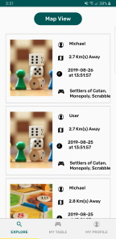
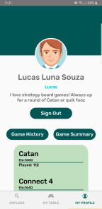

# Gamelo

A social platform for board game lovers that allows users to meet, compete and become the certified best at their favourite game

Built using React Native, Node.js, MongoDB and Docker

https://devpost.com/software/gamelo





## Setup

### Install

```sh
npm i -g react-native
npm install
```

### Start bundler

```sh
npm start -- --reset-cache
```

### Launch app

```sh
react-native run-android
```

### Run server

```
docker volume create db_volume
docker-compose build
docker-compose run
```